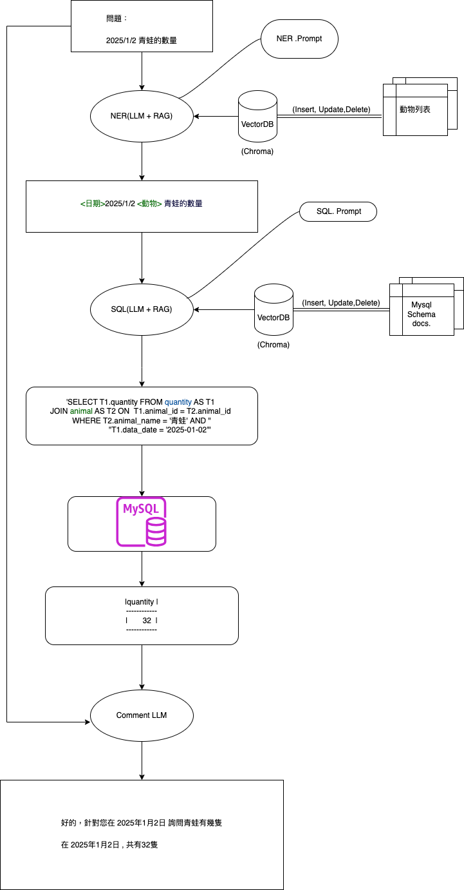

# RAG
 主要研究RAG 在sql 上的商業應用

 2025/06/26 Update: 
    
 實測在RAG SQL 之前加入 NER 的預處理,問題能夠更精確(接近)特定領域的查詢

``
question : 1/2 青蛙的數量
``

➡️
``
NER : <日期>2025/1/2 <動物>青蛙的數量    （NER 自動辨識領域實體）
``

➡️
``
SQL : SELECT T1.quantity FROM quantity AS T1 
       JOIN animal AS T2 ON  T1.animal_id = T2.animal_id 
       WHERE T2.animal_name = '青蛙' AND  T1.data_date = '2025-01-02'
``

 
